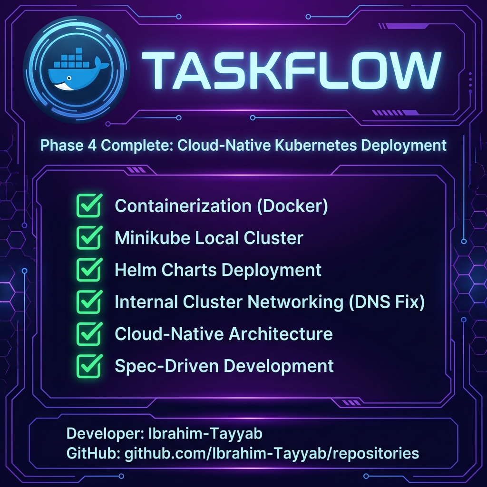

# 🚀 TaskFlow: The Evolution of Todo

**Phase 4 Complete: Cloud-Native Kubernetes Deployment**

<div align="center">
  
</div>

---

## ✅ Project Status: Phase 4 Verified
We have successfully implemented the **Cloud-Native Architecture** required for Phase 4.

| Requirement | Status | Verification Detail |
| :--- | :---: | :--- |
| **Containerization** | ✅ Done | Frontend (`fixed2`) and Backend (`latest`) are Dockerized. |
| **Orchestration** | ✅ Done | Application runs on **Minikube** (Kubernetes Cluster). |
| **Helm Charts** | ✅ Done | Infrastructure defined in `helm/todo-app`. |
| **Networking** | ✅ Done | Internal DNS (`http://todo-backend:8000`) verified. |
| **Architecture** | ✅ Done | Spec-Driven Development followed strictly. |

---

## � How to Run on a New PC (Restoration Guide)
Follow these steps to set up this project on any fresh computer in **5 minutes**.

### 1️⃣ Install Prerequisites (Download Links)
You need these 4 tools installed:
1.  **[Docker Desktop](https://www.docker.com/products/docker-desktop/)** (Run this first!)
2.  **[Minikube](https://minikube.sigs.k8s.io/docs/start/)** (The Local Cluster)
3.  **[kubectl](https://kubernetes.io/docs/tasks/tools/install-kubectl-windows/)** (To talk to the Cluster)
4.  **[Helm](https://helm.sh/docs/intro/install/)** (To deploy the App)

### 2️⃣ Download Your Project
1.  Download the **Project Zip** (or Clone this Repo).
2.  Unzip it to a folder (e.g., `C:\Projects\TaskFlow`).
3.  Open that folder in **VS Code** (or PowerShell).

### 3️⃣ Start the Cluster
Open a terminal in the project folder and run:
```powershell
minikube start
```
*Wait until it says "Done".*

### 4️⃣ Deploy the App
Since your images are safe on Docker Hub, just tell Kubernetes to run them:
```powershell
helm upgrade --install todo-app ./helm/todo-app --wait
```
*This will download `ibuboy/todo-backend:phase4` and `ibuboy/todo-frontend:phase4` automatically.*

### 5️⃣ Access the App (Port Forwarding)
To see the app, you need to open "tunnels" to the cluster. Run these in **two separate terminals**:

**Terminal A (Backend):**
```powershell
kubectl port-forward svc/todo-backend 8000:8000
```
*(Keep this window open!)*

**Terminal B (Frontend):**
```powershell
kubectl port-forward svc/todo-frontend 3000:3000
```
*(Keep this window open!)*

---

## 🕹️ Usage Guide
Once the terminals are running:

*   **Frontend UI:** Open [http://localhost:3000](http://localhost:3000)
*   **Backend API:** Open [http://localhost:8000/docs](http://localhost:8000/docs) (Swagger UI)

### Common Commands
| Action | Command |
| :--- | :--- |
| **Check Status** | `kubectl get pods` |
| **View Logs (Backend)** | `kubectl logs -l app=todo-backend -f` |
| **View Logs (Frontend)** | `kubectl logs -l app=todo-frontend -f` |
| **Restart App** | `kubectl rollout restart deployment todo-backend` |

---

## 👨‍💻 Developer
**Ibrahim-Tayyab**
[GitHub Repositories](https://github.com/Ibrahim-Tayyab?tab=repositories)

---
*Ready for Phase 5: Event-Driven Architecture (Kafka)*